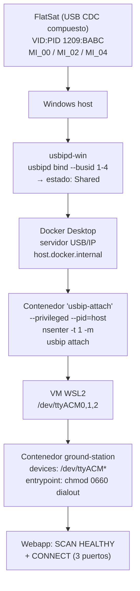

# Docker + USB en Windows: qué se hizo y por qué

> [!abstract] Resumen en una frase
> El contenedor de la webapp **no veía la placa** porque Docker Desktop corre los contenedores
> dentro de una VM WSL2 que **no tiene acceso a los puertos COM de Windows**. La solución no fue
> "compartir USB con WSL", sino usar el **servidor USB/IP que ya trae Docker Desktop** en
> `host.docker.internal`,Previo: dos ajustes en el repo (permisos del device node y un script de
> automatización) que son la diferencia entre "detecta la placa" y "conecta la placa".

---

## 1. El síntoma

En Windows, la webapp arrancada con `docker compose up` **escanía cero dispositivos**, aunque la
placa esté conectada y funcionando:

```
SCAN  ->  {"devices": []}
CONNECT -> {"error": "Failed to connect"}
```

La misma placa, ejecutada de forma nativa (`python -m webapp.app`), se detectaba y conectaba sin
problemas. Esa diferencia era la pista.

---

## 2. Por qué falla: la arquitectura de Docker Desktop

> [!warning] El punto clave
> Docker Desktop **no ejecuta los contenedores en Windows**. Los ejecuta en una VM Linux basada en
> WSL2 ([[WSL2]]). Para el contenedor, "el host" es esa VM, **no tu Windows**.

De ahí se deduce todo lo demás:

| Lo que hace el usuario | Lo que ve el contenedor |
|---|---|
| Conecta la placa por USB | Un dispositivo CDC compuesto |
| Windows lo expone como `COM30/31/32` | **Nada**: en Linux los puertos son `/dev/ttyACM*` |
| Dispositivo en el Administrador de dispositivos | Nodo USB dentro de la VM WSL2 |

### El `docker-compose.yml` original estaba pensado para Linux

```yaml
volumes:
  - /dev:/dev          # en Linux aquí están /dev/ttyACM*
  - /sys:/sys:ro
  - /run/udev:/run/udev:ro
```

Estos bind mounts solo tienen sentido en un **host Linux**. En Windows no hay `/dev` con la placa:
el bind mount monta el `/dev` de la VM, que está vacío de dispositivos USB.

---

## 3. El camino muerto: `usbipd-win` + WSL

Lo primero que probé fue el método que aparece en la documentación de Microsoft
(*Connect USB devices to WSL*): `usbipd-win` + `attach --wsl`.

```powershell
usbipd bind   --busid 1-4
usbipd attach --wsl docker-desktop --busid 1-4
```

> [!bug] Por qué se descartó
> Presentaba tres problemas que lo hicieron inviable para el uso diario:
>
> 1. **La instancia WSL se colgaba.** `wsl -d Ubuntu --exec ...` se quedaba bloqueado hasta
>    agotar el timeout (120 s) con el dispositivo adjunto. Tuve que matar los procesos `wsl`/`vmmem`.
> 2. **No persistía.** Cada `docker compose down/up` reseteaba la VM WSL y los nodos
>    `/dev/ttyACM*` desaparecían, aunque `usbipd list` siguiera diciendo `Attached`. Había que
>    re-anexar el dispositivo a mano en cada arranque.
> 3. **El distro `docker-desktop` no expone los nodos.** Aun con el dispositivo anexado y el
>    driver `cdc_acm` cargado (`/dev/ttyACM0-2` presentes), el contenedor no los veía.

Además dejó el FlatSat en un estado *limbo* que hubo que recuperar desconectando y reconectando
el cable USB.

---

## 4. La solución: USB/IP nativo de Docker Desktop

> [!tip] El giro
> No hay que "meter USB en WSL". Docker Desktop **publica un servidor USB/IP** accessible desde
> los contenedores en el host virtual `host.docker.internal`. Los dispositivos USB de Windows se
> exportan a través de él usando las herramientas `usbip` **dentro de un contenedor privilegiado**.

Flujo completo:



### El paso que lo cambiaba todo: `usbipd bind`

Sin marcar el dispositivo como **compartido**, el servidor de Docker no lo exporta. Este es el
detalle que_costó encontrar`:

```console
$ usbip list -r host.docker.internal
usbip: info: no exportable devices found on host.docker.internal   # ← sin bind

# tras: usbipd bind --busid 1-4
$ usbip list -r host.docker.internal
Exportable USB devices
 - host.docker.internal
       1-4: Generic : unknown product (1209:babc)
          : USB\VID_1209&PID_BABC\5033423532300010
          :  0 - Communications / Abstract (modem)      # MI_00 → Radio0
          :  2 - Communications / Abstract (modem)      # MI_02 → Radio1
          :  4 - Communications / Abstract (modem)      # MI_04 → Shell
```

### Los comandos exactos

```powershell
# 1. Compartir el dispositivo (imprescindible). Requiere Administrador.
usbipd bind --busid 1-4

# 2. Adjuntarlo por USB/IP. El contenedor debe SEGUIR VIVO.
docker run -d --name usbip-attach --privileged --pid=host alpine `
  sh -c "nsenter -t 1 -m -- usbip attach -r host.docker.internal -d 1-4 && echo ATTACHED_OK && sleep infinity"

# 3. Verificar dentro del contenedor de la app
docker exec flatsat-ground-station python -c "from modules.core.serial_manager import discover_devices; print(discover_devices())"
```

> [!note] ¿Por qué `--privileged --pid=host` y `nsenter`?
> Las herramientas `usbip` no están en la imagen del proyecto, sino en el **namespace de montaje
> del proceso PID 1 de la VM**. Con `--pid=host` el contenedor ve ese PID 1, y `nsenter -t 1 -m`
> entra en su namespace para usar `usbip` con las rutas correctas.

---

## 5. Los cambios en el repo

### 5.1 `docker-compose.yml` — mapear los puertos explícitamente

**Qué:** se quitó el bind mount `/dev:/dev` y se añadieron los dispositivos por nombre.

```yaml
    volumes:
      - ./db:/app/db
      - /sys:/sys:ro
      - /run/udev:/run/udev:ro

    # Dispositivos USB serie (FlatSat/CatSniffer) — requiere usbipd-win en Windows
    devices:
      - /dev/ttyACM0:/dev/ttyACM0
      - /dev/ttyACM1:/dev/ttyACM1
      - /dev/ttyACM2:/dev/ttyACM2
```

**Por qué:** `/dev:/dev` no propaga los dispositivos cuando el origen es USB/IP dentro de la VM.
`devices:` hace que runc cree los nodos explícitamente en el contenedor.

> [!caution] Limitación conocida
> Las rutas están fijas a `ttyACM0-2`. En un **host Linux** con otros adaptadores USB ya
> conectados la numeración puede desplazarse y el mapa no coincidir. Es válido para el caso de uso
> actual (una placa, sin otros dongle CDC). Pendiente: hacerlo dinámico.

### 5.2 `docker-entrypoint.sh` — permisos del device node

**Qué:** antes de bajar privilegios con `gosu`, se corrigen los permisos de los puertos serie.

```sh
for dev in /dev/ttyACM* /dev/ttyUSB*; do
    [ -e "$dev" ] || continue
    chgrp dialout "$dev" 2>/dev/null || true
    chmod 0660 "$dev" 2>/dev/null || true
done

exec gosu appuser "$@"
```

**Por qué:** este fue un bug muy confuso. runc crea los nodos como **`0600 root:root`**:

```console
$ docker exec flatsat-ground-station python -c "import os,stat; print(oct(stat.S_IMODE(os.stat('/dev/ttyACM2').st_mode)))"
0o600   uid: 0 gid: 0
```

La webapp corre como `appuser` (no-root, vía `gosu`). Resultado:

| Quién abre el puerto | Resultado |
|---|---|
| `docker exec` (root) | ✅ funciona |
| webapp (`appuser`) | ❌ `SerialException: [Errno 13] Permission denied` |

Por eso el escaneo en consola veía la placa pero la UI decía `Failed to connect`. El grupo
`dialout` ya estaba asignado a `appuser` en el `Dockerfile`; faltaba que los nodos fueran de ese
grupo. `0660` mantiene el acceso restringido (solo root y `dialout`).

### 5.3 `scripts/docker_usb_windows.ps1` — automatizar el setup

**Qué:** script nuevo que hace todo el proceso y deja el servicio funcionando.

**Por qué:** el setup manual hay que repetirlo **cada vez** que se reconecta la placa, se
reinicia Docker Desktop o se cierra WSL. El script:

1. Localiza solo el BUSID del FlatSat (busca VID:PID `1209:babc` y adaptadores CDC comunes).
2. `usbipd bind`.
3. Comprueba si ya está adjunto (idempotente).
4. Arranca el contenedor `usbip-attach`.
5. Espera la señal `ATTACHED_OK`.
6. `docker compose down --remove-orphans` + `up -d --build`.
7. Imprime el escaneo desde dentro del contenedor.

```powershell
# Conectar (PowerShell como Administrador)
.\scripts\docker_usb_windows.ps1

# Desconectar
.\scripts\docker_usb_windows.ps1 -Detach
```

Detalles de robustez que se añadieron al probarlo:

- **Autolocalización:** `Set-Location` a la raíz del repo, porque un proceso elevado arranca en
  `C:\Windows\System32` y `docker compose` no encontraba el fichero.
- **Registro:** escribe un log en `%TEMP%\flatsat-usbip\`, ya que la salida de un proceso elevado
  no se puede redirigir desde fuera (`Start-Process -Verb RunAs` no admite redirección).
- **`$ErrorActionPreference = 'Continue'`:** Docker escribe el progreso de `build` por *stderr* y
  PowerShell 5.1 lo convierte en errorRecord, abortando el script aunque todo fuese correcto.

---

## 6. El segundo bug: la adjunción colgada

> [!warning] Síntoma
> `CONNECT` se quedaba colgado más de 120 s. Los logs del contenedor mostraban que la webapp
> seguía respondiendo (el polling de `/api/hardware/status` a 200), pero el proceso de connect no
> terminaba nunca.

**Diagnóstico:** el contenedor `usbip-attach` había muerto, pero los nodos `/dev/ttyACM*`
**seguían existiendo** en la VM. Abrirlos se bloqueaba indefinidamente:

```console
$ timeout 15 python -c "serial.Serial('/dev/ttyACM2', 115200)"
# (no retorna nunca)
```

**Por qué:** el cliente USB/IP es el que mantiene la conexión con el dispositivo. Si muere, la
placa deja de responder, pero los nodos quedan zombis.

**Solución en el script:** el estado del contenedor `usbip-attach` es la fuente de verdad. Si no
está corriendo pero los nodos existen, hay una adjunción colgada → se suelta con
`usbip detach` y se vuelve a adjuntar. El script ya **no borra el contenedor de attach** cuando
reutiliza la conexión (un error de la primera versión que causaba justamente esto).

---

## 7. Verificación

```console
$ # Escaneo: UN dispositivo con sus 3 endpoints
{"devices":[{"serial_number":"5033423532300010","health":"HEALTHY","is_complete":true,
             "radio0":"/dev/ttyACM0","radio1":"/dev/ttyACM1","shell":"/dev/ttyACM2"}]}

$ # Conexión: los 3 puertos a la vez
{"endpoints":{"radio0":true,"radio1":true,"shell":true},"mode":"hardware"}

$ # Prueba de que están abiertos simultáneamente (fds del proceso webapp)
1 /dev/ttyACM0
1 /dev/ttyACM1
1 /dev/ttyACM2

$ # Funcionalidad
FW: dev-3aa4142-dirty
```

El mapeo de endpoints es **coherente entre Windows y Docker** porque el orden de interfaces del
dispositivo CDC compuesto es el mismo:

| Interfaz USB | Endpoint | Windows | Docker |
|---|---|---|---|
| `MI_00` | Radio0 | `\\.\COM32` | `/dev/ttyACM0` |
| `MI_02` | Radio1 | `\\.\COM31` | `/dev/ttyACM1` |
| `MI_04` | Shell  | `\\.\COM30` | `/dev/ttyACM2` |

Esto lo resuelve `_INTF_TO_ENDPOINT` en [[serial_manager]]: `{0: Radio0, 2: Radio1, 4: Shell}`,
tomando el número de interfaz del campo `LOCATION=` del HWID.

---

## 8. Limitaciones y pendientes

- [ ] **Rutas fijas `ttyACM0-2`**: rompe si en Linux hay otros dispositivos CDC antes.
- [ ] **Hay que repetir el script** tras cada reconexión de la placa o reinicio de Docker/WSL.
      Podría integrarse en un servicio que lo ejecute automáticamente.
- [ ] **Requiere Administrador** para `usbipd bind`.
- [ ] **El attach se mantiene "en un contenedor"**: si alguien hace `docker system prune` o
      borra `usbip-attach`, la placa queda zombi hasta re-ejecutar el script.
- [ ] Sin probar en **Linux nativo** (donde los bind mounts originales sí funcionarían) — convendría
      no romper ese caso de uso.
- [ ] Pendiente de **commit**: los cambios están sin commitear en la rama de trabajo.

---

## 9. Glosario

| Término | Significado |
|---|---|
| **USB/IP** | Protocolo que permite compartir dispositivos USB por red. Docker Desktop lo expone en `host.docker.internal`. |
| **usbipd-win** | Utilidad de Windows que actúa como servidor USB/IP y marca dispositivos como compartibles. |
| **`usbip bind`** | Marca el dispositivo como *Shared*. **Requisito previo** para que Docker lo exporte. |
| **`usbip attach`** | Cliente Linux que conecta el dispositivo exportado. |
| **BUSID** | Identificador del puerto USB en Windows, p.ej. `1-4`. |
| **`vhci_hcd`** | "Virtual Host Controller Interface": el driver que presenta por USB/IP lo que llega desde Windows. |
| **`--pid=host`** | Hace que el contenedor comparta el namespace de procesos de la VM, permitiendo ver el PID 1. |
| **`nsenter -t 1 -m`** | Entra en el namespace de montaje del PID 1, donde están las herramientas `usbip`. |
| **MI_xx** | "Multi-Interface": cada función CDC del dispositivo compuesto (00, 02, 04). |
| **`dialout`** | Grupo Unix con acceso a puertos serie. `appuser` pertenece a él. |

---

## 10. Ficheros relacionados

- [[docker-compose]] — mapeo de dispositivos y configuración del servicio
- [[docker-entrypoint]] — permisos de los puertos serie antes de `gosu`
- [[serial_manager]] — descubrimiento y mapeo de endpoints (Radio0/Radio1/Shell)
- [[device]] — `FlatSatDevice.connect()` e `is_connected`
- `scripts/docker_usb_windows.ps1` — script de conexión (runbook)
- Documentación oficial: [Using USB/IP with Docker Desktop](https://docs.docker.com/desktop/features/usbip/)
